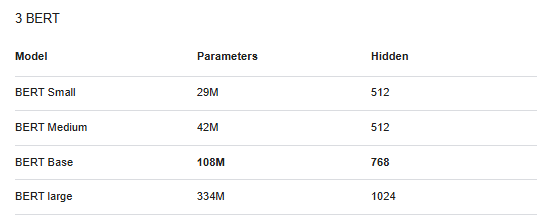

# BERT MODEL



## HuggingFace have multiple classes for BERT
Hugging Face provides various BERT-based models designed for specific NLP tasks. While all these models are built on top of the core BERT architecture (`BertModel`), they include task-specific heads to address different NLP problems. Here's an overview of each:

---

### 1. **`BertModel`**
- **Purpose**: The base BERT model without any task-specific head.
- **Outputs**:
  - `last_hidden_state`: Hidden states for all tokens (shape: `[batch_size, sequence_length, hidden_size]`).
  - `pooler_output`: A pooled representation of the `[CLS]` token (shape: `[batch_size, hidden_size]`).
- **Use Cases**: Use this when you need embeddings for downstream tasks like sentence similarity, clustering, or token-level tasks, and you plan to build your own custom head.
- **Example**:
  ```python
  from transformers import BertModel, BertTokenizer
  tokenizer = BertTokenizer.from_pretrained('bert-base-uncased')
  model = BertModel.from_pretrained('bert-base-uncased')
  inputs = tokenizer("Hello, how are you?", return_tensors="pt")
  outputs = model(**inputs)
  print(outputs.last_hidden_state.shape)  # [batch_size, sequence_length, hidden_size]
  ```

---

### 2. **`BertForSequenceClassification`**
- **Purpose**: Adds a classification head to `BertModel` for sequence-level tasks like sentiment analysis, spam detection, or topic classification.
- **Architecture**: 
  - Base `BertModel` with a fully connected classification layer on top of the `[CLS]` token.
- **Outputs**:
  - `logits`: Raw predictions for each class (shape: `[batch_size, num_labels]`).
- **Use Cases**: Sequence classification tasks (e.g., binary/multi-class classification).
- **Example**:
  ```python
  from transformers import BertForSequenceClassification
  model = BertForSequenceClassification.from_pretrained('bert-base-uncased', num_labels=2)
  outputs = model(**inputs)
  print(outputs.logits)  # [batch_size, num_labels]
  ```

---

### 3. **`BertForTokenClassification`**
- **Purpose**: Adds a classification head to `BertModel` for token-level tasks like named entity recognition (NER) or part-of-speech tagging.
- **Architecture**:
  - Base `BertModel` with a classification layer applied to each token's hidden state.
- **Outputs**:
  - `logits`: Predictions for each token (shape: `[batch_size, sequence_length, num_labels]`).
- **Use Cases**: Token classification tasks where each token needs a label.
- **Example**:
  ```python
  from transformers import BertForTokenClassification
  model = BertForTokenClassification.from_pretrained('bert-base-uncased', num_labels=5)
  outputs = model(**inputs)
  print(outputs.logits.shape)  # [batch_size, sequence_length, num_labels]
  ```

---

### 4. **`BertForMultipleChoice`**
- **Purpose**: Adds a head for multiple-choice tasks, such as selecting the correct answer from several options (e.g., reading comprehension with options).
- **Architecture**:
  - Base `BertModel` with a classification head applied to the `[CLS]` token for each choice.
- **Inputs**:
  - Input tensor should be shaped as `[batch_size, num_choices, sequence_length]`.
- **Outputs**:
  - `logits`: Predictions for each choice (shape: `[batch_size, num_choices]`).
- **Use Cases**: Multiple-choice tasks like SWAG or RACE.
- **Example**:
  ```python
  from transformers import BertForMultipleChoice
  model = BertForMultipleChoice.from_pretrained('bert-base-uncased')
  inputs = {k: v.unsqueeze(1).repeat(1, 4, 1) for k, v in inputs.items()}  # Mock 4 choices
  outputs = model(**inputs)
  print(outputs.logits.shape)  # [batch_size, num_choices]
  ```

---

### 5. **`BertForQuestionAnswering`**
- **Purpose**: Adds a head for extractive question answering, such as predicting the span of text in a passage that answers a question.
- **Architecture**:
  - Base `BertModel` with two heads for predicting the start and end positions of the answer in the input sequence.
- **Outputs**:
  - `start_logits`: Scores for the start position of the answer (shape: `[batch_size, sequence_length]`).
  - `end_logits`: Scores for the end position of the answer (shape: `[batch_size, sequence_length]`).
- **Use Cases**: Tasks like SQuAD, where the goal is to extract a span of text as the answer.
- **Example**:
  ```python
  from transformers import BertForQuestionAnswering
  model = BertForQuestionAnswering.from_pretrained('bert-base-uncased')
  outputs = model(**inputs)
  print(outputs.start_logits.shape)  # [batch_size, sequence_length]
  print(outputs.end_logits.shape)    # [batch_size, sequence_length]
  ```

---

### Summary of Key Differences

| **Model Type**                | **Task**                                 | **Outputs**                                 | **Use Cases**                                       |
|-------------------------------|------------------------------------------|--------------------------------------------|----------------------------------------------------|
| `BertModel`                   | General-purpose encoder                 | Hidden states, pooled output               | Embeddings, custom tasks                          |
| `BertForSequenceClassification` | Sequence classification                | Logits for each class                      | Sentiment analysis, text classification           |
| `BertForTokenClassification`   | Token classification                   | Logits for each token                      | Named entity recognition, POS tagging            |
| `BertForMultipleChoice`        | Multiple-choice classification         | Logits for each choice                     | SWAG, RACE, multiple-choice comprehension         |
| `BertForQuestionAnswering`     | Extractive question answering          | Start and end logits                       | SQuAD-style tasks, passage span extraction        |

---

Each model builds on `BertModel` but tailors its architecture and outputs for specific NLP tasks, making it easier to fine-tune for your needs. Would you like more details or examples on any specific model?


# How the Dataset for Each Task look like? 


### 1. **Sequence Classification (`BertForSequenceClassification`)**

#### **Input Data**:
- **Task**: Classifying a sentence into categories (e.g., positive/negative sentiment, spam/ham).
- **Input Example**: A single sentence to classify.

#### **Dataset**:
- The dataset consists of text samples and their associated labels. For a binary classification task, the labels would be 0 and 1.

#### **Example**:
| Text                               | Label |
|------------------------------------|-------|
| "I love this movie!"               | 1     |
| "This is the worst movie I've seen." | 0     |

#### **Input Format**:
- The text will be tokenized using BERT's tokenizer into token IDs.
- The model needs `input_ids`, `attention_mask`, and `labels`.

#### **Example of Tokenization**:
```python
from transformers import BertTokenizer

tokenizer = BertTokenizer.from_pretrained('bert-base-uncased')

# Example sentence
sentence = "I love this movie!"
encoding = tokenizer(sentence, return_tensors="pt")

# Get token IDs and attention mask
print(encoding['input_ids'])  # Token IDs
print(encoding['attention_mask'])  # Attention mask
```

**Input to Model**:
```python
from transformers import BertForSequenceClassification

# Create the dataset for the model (labels and tokenized inputs)
labels = torch.tensor([1])  # Example label (1 for positive sentiment)
outputs = model(input_ids=encoding['input_ids'], 
                attention_mask=encoding['attention_mask'], 
                labels=labels)
```

---

### 2. **Token Classification (`BertForTokenClassification`)**

#### **Input Data**:
- **Task**: Token-level classification, such as Named Entity Recognition (NER) or part-of-speech tagging.

#### **Dataset**:
- The dataset consists of tokens (subwords) and their associated labels. Each token in the sentence is labeled with a category.

#### **Example**:
| Word     | Label   |
|----------|---------|
| "John"   | B-PER   |
| "lives"  | O       |
| "in"     | O       |
| "Paris"  | B-LOC   |
| "!"      | O       |

#### **Input Format**:
- The text will be tokenized, and each token will have a label assigned to it.
- The model expects `input_ids`, `attention_mask`, and `labels` (a list of token labels).

#### **Example of Tokenization**:
```python
sentence = "John lives in Paris!"
encoding = tokenizer(sentence, return_tensors="pt", padding=True, truncation=True)

# Get token IDs and attention mask
print(encoding['input_ids'])  # Token IDs
print(encoding['attention_mask'])  # Attention mask
```

#### **Input to Model**:
```python
labels = torch.tensor([2, 0, 0, 1, 0])  # Labels for each token in the sentence
outputs = model(input_ids=encoding['input_ids'], 
                attention_mask=encoding['attention_mask'], 
                labels=labels)
```

---

### 3. **Multiple Choice (`BertForMultipleChoice`)**

#### **Input Data**:
- **Task**: The model needs to pick the correct answer from a set of options.
- **Input Example**: A question with multiple options.

#### **Dataset**:
- The dataset consists of pairs of questions and multiple choices. The goal is to predict the correct option from the set.

#### **Example**:
| Context                               | Question                                | Option 1  | Option 2  | Option 3  | Option 4  | Correct Answer |
|---------------------------------------|-----------------------------------------|-----------|-----------|-----------|-----------|----------------|
| "The Eiffel Tower is located in Paris." | "Where is the Eiffel Tower located?"   | "London"  | "Paris"   | "Berlin"  | "Rome"    | 1              |

#### **Input Format**:
- The model takes pairs of `question` and `option` as input.
- The model expects tokenized inputs for each pair and will output a classification score for each option.

#### **Example of Tokenization**:
```python
question = "Where is the Eiffel Tower located?"
options = ["London", "Paris", "Berlin", "Rome"]

inputs = tokenizer([[question, option] for option in options], padding=True, truncation=True, return_tensors="pt")

# Token IDs for each option
print(inputs['input_ids'])
```

#### **Input to Model**:
```python
labels = torch.tensor([1])  # Correct answer (index of "Paris")
outputs = model(input_ids=inputs['input_ids'], 
                attention_mask=inputs['attention_mask'], 
                labels=labels)
```

---

### 4. **Question Answering (`BertForQuestionAnswering`)**

#### **Input Data**:
- **Task**: Predict the start and end positions of the answer in a given context.
- **Input Example**: A question and context text, where the model should identify the span of the answer.

#### **Dataset**:
- The dataset consists of context and questions along with the `start` and `end` positions of the answer.

#### **Example**:
| Context                               | Question                           | Start Position | End Position |
|---------------------------------------|------------------------------------|----------------|--------------|
| "The Eiffel Tower is located in Paris." | "Where is the Eiffel Tower located?" | 8              | 13           |

#### **Input Format**:
- The model expects the `context` and `question` to be tokenized.
- The model outputs `start_logits` and `end_logits` to predict the answer span.

#### **Example of Tokenization**:
```python
context = "The Eiffel Tower is located in Paris."
question = "Where is the Eiffel Tower located?"

inputs = tokenizer(question, context, padding=True, truncation=True, return_tensors="pt")

# Token IDs and Attention Mask
print(inputs['input_ids'])
```

#### **Input to Model**:
```python
# For question answering, we need start and end positions
start_positions = torch.tensor([8])  # Start position of the answer
end_positions = torch.tensor([13])   # End position of the answer

outputs = model(input_ids=inputs['input_ids'], 
                attention_mask=inputs['attention_mask'], 
                start_positions=start_positions, 
                end_positions=end_positions)
```

---

### General Notes on Dataset Structure and Tokenizer Output

1. **Dataset Structure**:
   - **Sequence Classification**: A list of text samples and corresponding labels.
   - **Token Classification**: A list of text samples where each token has a corresponding label.
   - **Multiple Choice**: A list of question-option pairs with the correct option index.
   - **Question Answering**: A list of question-context pairs, along with the start and end positions of the answer.

2. **Tokenizer Output**:
   - **`input_ids`**: The list of token IDs for the input text.
   - **`attention_mask`**: A mask where 1 indicates a real token, and 0 indicates padding tokens.
   - **`token_type_ids`**: (Optional) Used to distinguish between sentences in tasks like **question answering or sentence pair tasks**.
   - **`labels`**: For supervised tasks, these are the target labels (e.g., class labels, token labels, or answer spans).

---

### Conclusion:
- The structure of the dataset varies depending on the task.
- For sequence classification, you need pairs of text and labels.
- For token classification, you'll need text with token-level labels.
- For multiple choice, you'll need question-option pairs with correct answer indices.
- For question answering, you'll need question-context pairs with start and end positions of the answers.